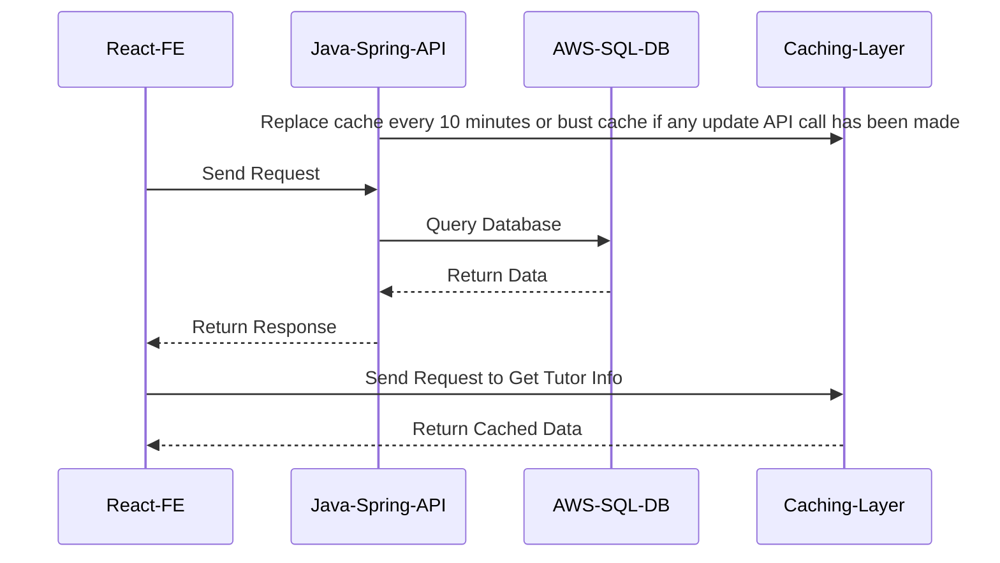

# online-tutoring-app-backend
Backend Rest API Service Powered by Java and Spring for the Online Tutoring Application

## SETUP -
1. Download Java version 17
2. [Download intellij IDEA](https://www.jetbrains.com/idea/download/#section=windows)
3. `mvn clean install` [This is a MAVEN PROJECT]
4. Run the main function present in  `src/main/java/onlinetutoring/com/teamelevenbackend/TeamElevenBackendApplication.java`

## Database - 
The Application uses Postgres DB and is hosted on AWS

Credentials -
* host-name: `CONTACT-ADMIN`
* port: `CONTACT-ADMIN`
* username: `CONTACT-ADMIN`
* password: `CONTACT-ADMIN`

### Deployment -
The backend is deployed using [railway](https://railway.app/dashboard)

#### NEW ENVIRONMENTS - 

- production - `CONTACT-ADMIN`
- localhost - `http://localhost:8080`

> DO NOT PUSH TO PRODUCTION WITHOUT A PULL REQUEST

#### TESTING -
* You can use the `postman testing suite` with the app running locally

### INFRASTRUCTURE - 

